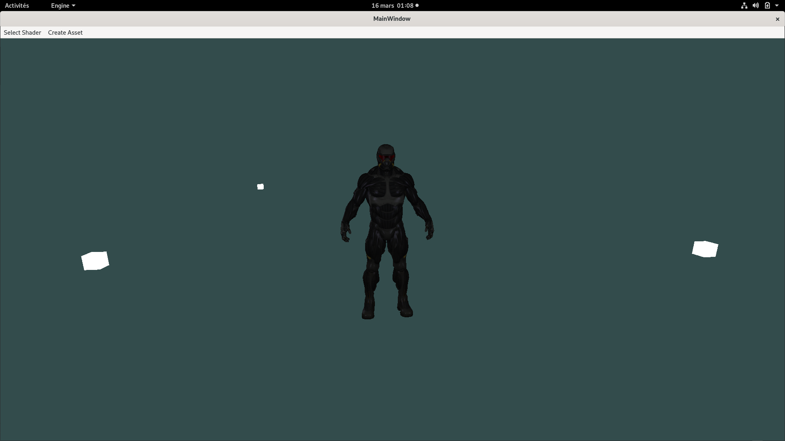
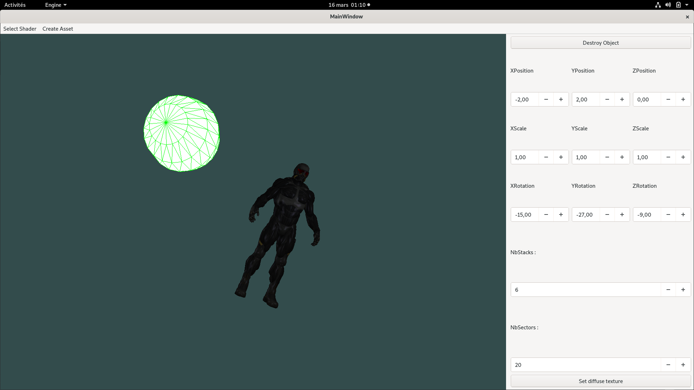
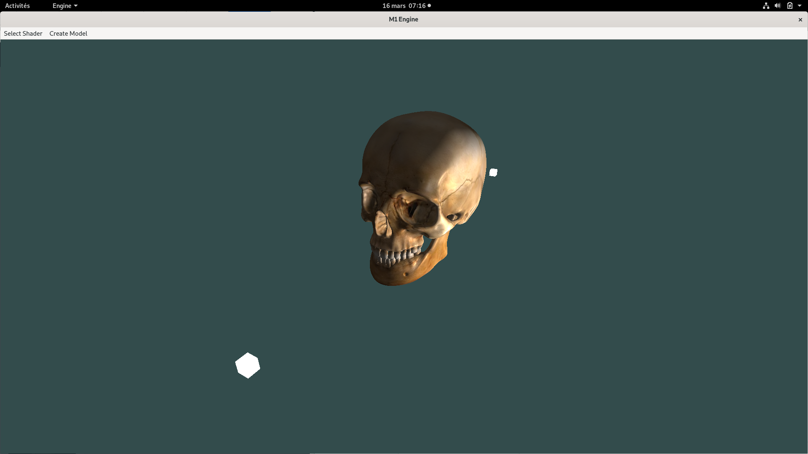
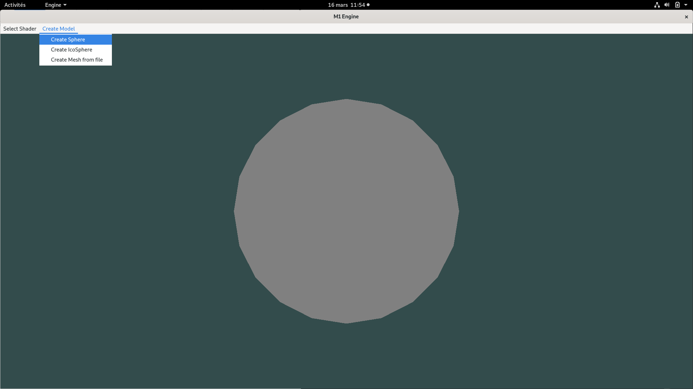
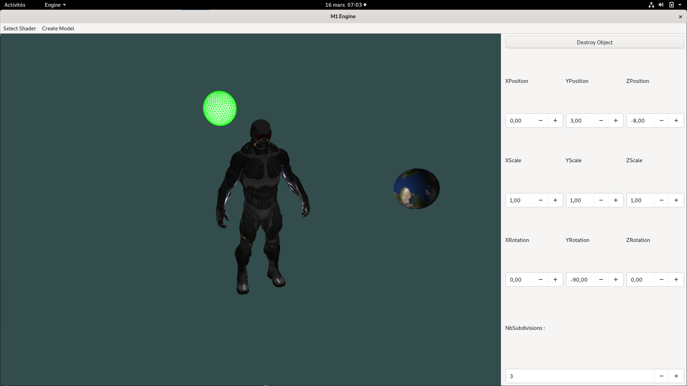

#M1 IIG3D Engine

## Dependencies
- [STB](https://github.com/nothings/stb.git) (Submodule in repo)
- [GLM](https://github.com/g-truc/glm) (Submodule in repo)
- [Assimp](https://github.com/assimp/assimp.git)
- GLSL/OpenGL
- Qt
    
## Compiling
Run from root directory of the repo :
```
$ mkdir build
$ cd build
$ cmake ..
$ make
```

## Executing
```
$ cd ../bin
$ ./Engine
```

##Features

###Models creation
You can create 3 different kinds of models.
- UV Sphere
- IcoSphere
- Any pre-existing model from an .obj file


###Shaders
There is currently 3 shaders available:
- Basic texture : a simple shader to display the texture or color of the models.
- Phong : a Phong shading and reflection model that handle diffuse and specular textures.
- Approximation error : a shader designed to represent the approximation error of the IcoSphere and the UVSphere compared to the analytical definition of a sphere.





###Edition
- For now, there is no way to select or move an object with the mouse.
- To iterate through the list of existing models, you can press the keys `+` and `-`.
- To deselect the current selection, you can press `Esc`.
- When a model is selected, a panel opens which allows the user to edit the model in number of ways depending of the type of model.
    - All : Position, Rotation and Scale
    - UV Sphere : Number of stacks and sectors. You can also choose a diffuse texture to apply by clicking on **Set diffuse texture**.
    - IcoSphere : Number of subdivisions, be careful, a great number of subdivisions may result in some slow down.
- To destroy a model, simply click on the **Destroy object** button.





###Keys 
- `+`/`-` : Iterate over the list of models.
- `Esc` : Deselect the current selection.
- `L` : Set lights visible/unvisible.
- `W` : Set wireframe mode on/off.
- `P` : Change camera type.


###3 points Lighting
For now, lights in the scene are static Point lights and are organized to create a 3 points lighting for a subject situated in the center of the scene.





##Exemples




---



